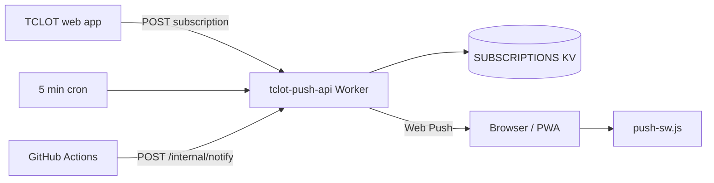

# TCLOT Web Push API (Cloudflare Worker)

Stores browser push subscriptions and sends league alerts (GW deadlines, waiver results, live kickoff) to TCLOT managers who opt in from the web app Settings screen.

## Architecture



## One-time setup

```bash
cd web/workers/push-api
npm install
npm run generate-vapid
```

1. Create the KV namespace and paste its id into `wrangler.toml`:

   ```bash
   npx wrangler kv:namespace create SUBSCRIPTIONS
   ```

2. Set secrets (values from `npm run generate-vapid`):

   ```bash
   npx wrangler secret put VAPID_SUBJECT
   npx wrangler secret put VAPID_SERVER_PUBLIC_KEY
   npx wrangler secret put VAPID_SERVER_PRIVATE_KEY
   npx wrangler secret put PUSH_INTERNAL_SECRET
   ```

3. Deploy:

   ```bash
   npm run deploy
   ```

4. Wire the web app at build time (no trailing slash):

   ```bash
   # web/.env.local
   VITE_PUSH_API_URL=https://tclot-push-api.your-subdomain.workers.dev
   VITE_VAPID_PUBLIC_KEY=<public key from generate-vapid>
   ```

   Add the same names to GitHub Actions secrets/variables for production builds.

## Endpoints

| Method | Path | Purpose |
|--------|------|---------|
| GET | `/health` | Worker + VAPID readiness |
| GET | `/vapid-public-key` | Public VAPID key (fallback if not baked into build) |
| POST | `/subscriptions` | Register/update a browser push subscription |
| DELETE | `/subscriptions` | Unsubscribe |
| POST | `/internal/notify` | CI/admin trigger (`Authorization: Bearer $PUSH_INTERNAL_SECRET`) |

## Scheduled alerts

Cron runs every 5 minutes. There are three user-facing alert types (matching the Settings toggles):

- **Deadline reminders** (`deadlineReminders`) — 24h and 1h before the GW **waiver deadline** (`waivers_time`); 1h only before the **lineup deadline** (`deadline_time`). Sent at most once per bucket per GW.
- **Waiver results** (`waiverResults`) — within ~3h after `waivers_time`, once per GW.
- **Your live XI** (`liveXi`) — goals, assists, and defensive-contribution (+2) moments for players in the subscriber's **starting XI** (draft picks 1–11) during a live GW.

### Live XI engine (`src/liveXi.js`)

During a live GW the worker:

1. Reads draft `bootstrap-static` for element metadata (`web_name`, `element_type`).
2. Fetches each live-XI subscriber's GW picks (`entry/{entryId}/event/{gw}`), keeping starters (`position <= 11`).
3. Fetches `event/{gw}/live` and diffs `goals_scored`, `assists`, and defcon points against the previous poll (`live:totals:{gw}` in KV).
4. Sends each new event to the manager(s) who start that player, deduped by `${gw}:${el}:{kind}:tot{n}`.

The first poll of a GW only stores a baseline (no backfill flood). Live XI requires the subscriber to pick **My team** in Settings (stored as the draft `entry_id`).

## CI waiver ping (optional)

After a successful deploy ingest, call:

```bash
curl -X POST "$PUSH_API_URL/internal/notify" \
  -H "Authorization: Bearer $PUSH_INTERNAL_SECRET" \
  -H "Content-Type: application/json" \
  -d '{"type":"waiver_processed","gw":12}'
```

Set `PUSH_API_URL` and `PUSH_INTERNAL_SECRET` as GitHub Actions secrets.

## Local dev

Vite proxies `/__push/*` → your worker when `VITE_PUSH_API_URL` is set (see `web/vite.config.js`). Service worker scope follows `import.meta.env.BASE_URL`.

## Limits

- Requires HTTPS and a browser that supports Push + service workers (Chrome, Firefox, Edge; Safari 16.4+ on macOS/iOS with installed PWA).
- Notifications are opt-in from Settings; no auth — managers pick their team from a dropdown.
- Live XI polls the draft API on the cron cadence (every 5 min), so scoring alerts land within a few minutes, not instantly.
- Worker free tier: cron + KV reads/writes are modest for an 8-manager league.
